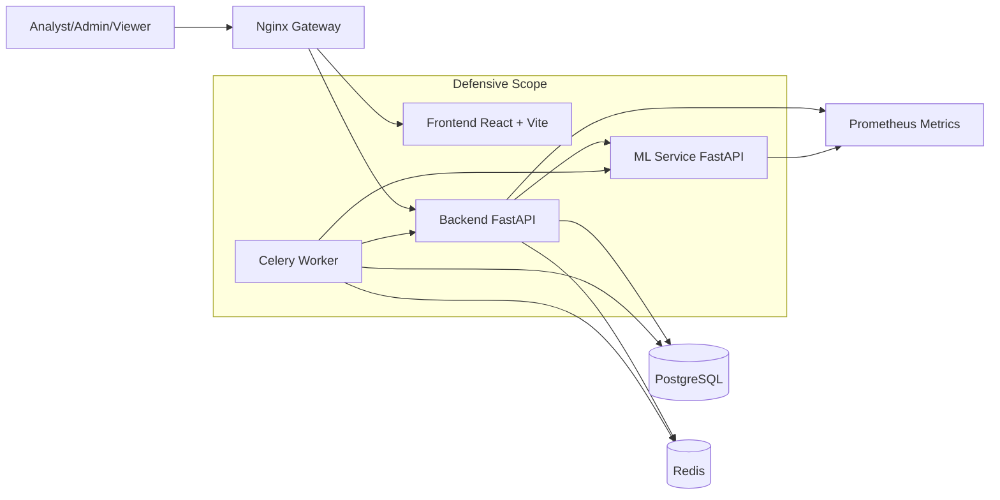

# ICS AI Attack Detection Microservices Platform

Production-oriented, defensive-only microservices platform for ICS traffic monitoring, anomaly detection, and attack classification in near real-time.

## Architecture Diagram



## Monorepo Tree

```text
.
|-- .env.example
|-- .gitignore
|-- docker-compose.yml
|-- README.md
|-- backend/
|   |-- .env.example
|   |-- Dockerfile
|   |-- requirements.txt
|   |-- seed_data.py
|   |-- alembic.ini
|   |-- alembic/
|   |   |-- env.py
|   |   `-- versions/20260408_01_init.py
|   |-- app/
|   |   |-- main.py
|   |   |-- api/
|   |   |   |-- dependencies.py
|   |   |   |-- router.py
|   |   |   `-- routes/
|   |   |       |-- auth.py
|   |   |       |-- traffic.py
|   |   |       |-- alerts.py
|   |   |       |-- model.py
|   |   |       `-- health.py
|   |   |-- core/
|   |   |-- db/
|   |   |-- models/
|   |   |-- schemas/
|   |   |-- services/
|   |   `-- tasks/
|   `-- tests/
|-- frontend/
|   |-- .env.example
|   |-- Dockerfile
|   |-- nginx.conf
|   |-- package.json
|   |-- vite.config.ts
|   |-- vitest.config.ts
|   `-- src/
|       |-- App.tsx
|       |-- App.test.tsx
|       |-- styles.css
|       |-- api/
|       |-- components/
|       `-- pages/
|-- ml-service/
|   |-- .env.example
|   |-- Dockerfile
|   |-- requirements.txt
|   |-- app/main.py
|   `-- tests/test_infer.py
|-- gateway/nginx.conf
`-- scripts/
    |-- api_collection.http
    |-- bootstrap.ps1
    |-- integration_test.py
    |-- run_tests.ps1
    `-- seed_data.py
```

## Security and Domain Coverage

- JWT authentication with RBAC roles: `admin`, `analyst`, `viewer`.
- Input schema includes ICS protocol fields: Modbus, DNP3, IEC104 metadata.
- Detection pipeline:
  - anomaly signal with `IsolationForest`
  - supervised class prediction with `RandomForestClassifier`
  - confidence + combined risk score
- Explainability: top feature contribution summary from model importances.
- Defensive monitoring only, no offensive capability.
- API protections: CORS, secure headers, input validation, rate limiting.
- Observability: structured JSON logs, `/healthz`, `/readyz`, `/metrics`.

## Core Services

- `frontend`: React + TypeScript + Vite, dashboard and analyst workflow.
- `backend`: FastAPI API, auth, RBAC, data persistence, alerting, model metadata.
- `ml-service`: FastAPI inference and retraining endpoints.
- `postgres`: primary relational store.
- `redis`: Celery broker/backend and queue cache.
- `backend-worker`: Celery retraining worker.
- `gateway`: Nginx reverse proxy and rate-limiting edge.

## Environment Setup

1. Copy root env:
   - `cp .env.example .env` (Linux/macOS)
   - `Copy-Item .env.example .env` (PowerShell)
2. Optionally tune `JWT_SECRET_KEY` and DB credentials.

## Run Commands

### One-command bootstrap (Windows PowerShell)

```powershell
./scripts/bootstrap.ps1
```

### Build

```powershell
docker compose build
```

### Start

```powershell
docker compose up -d
```

### Migrate DB

```powershell
docker compose exec backend alembic upgrade head
```

### Seed Data

```powershell
docker compose exec backend python seed_data.py
```

### Test

```powershell
./scripts/run_tests.ps1
```

## API Collection Examples

Use `scripts/api_collection.http` in VS Code REST client, or run these manually.

### Login

`POST /api/v1/auth/login`

```json
{
  "username": "admin",
  "password": "admin123"
}
```

### Upload Traffic

`POST /api/v1/traffic/ingest`

```json
{
  "source_ip": "10.0.0.11",
  "destination_ip": "10.0.0.55",
  "source_port": 50222,
  "destination_port": 502,
  "transport_protocol": "tcp",
  "packet_count": 75,
  "bytes_in": 3500,
  "bytes_out": 2800,
  "duration_ms": 155,
  "payload_entropy": 5.1,
  "modbus_function_code": 16,
  "modbus_unit_id": 4,
  "dnp3_function_code": 1,
  "iec104_type_id": 45,
  "ingestion_source": "json",
  "metadata_json": { "site": "west" }
}
```

### Run Detection

`POST /api/v1/traffic/{record_id}/detect`

### List Alerts

`GET /api/v1/alerts`

### Retrain Model

`POST /api/v1/model/retrain`

## Troubleshooting

- Gateway returns 502:
  - check `docker compose ps`
  - verify backend and frontend health checks passed.
- DB migration fails:
  - ensure postgres is healthy, then rerun `alembic upgrade head`.
- Auth fails with seed credentials:
  - rerun seed script and verify users table has entries.
- Retrain stuck queued:
  - verify `backend-worker` and `redis` are healthy.
- Frontend cannot load dashboard:
  - verify browser reaches `http://localhost:8080/api/v1/healthz`.
- High false positives:
  - trigger retrain and inspect model versions endpoint for active model changes.

## Defensive-use Notice

This platform is for ICS monitoring and detection only. It does not include exploitation, payload generation, or active attack functionality.
