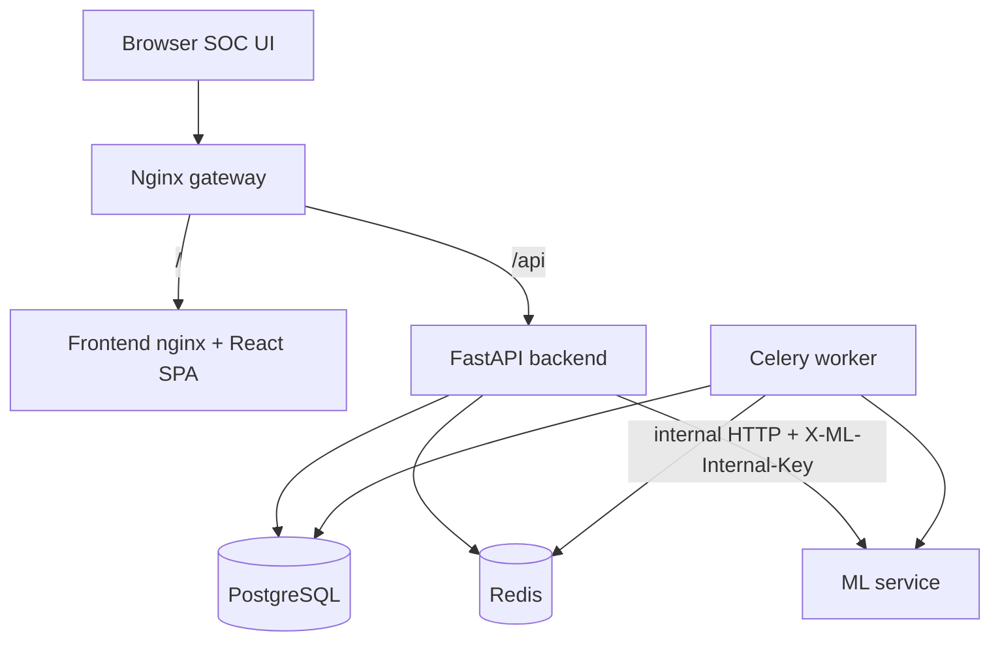
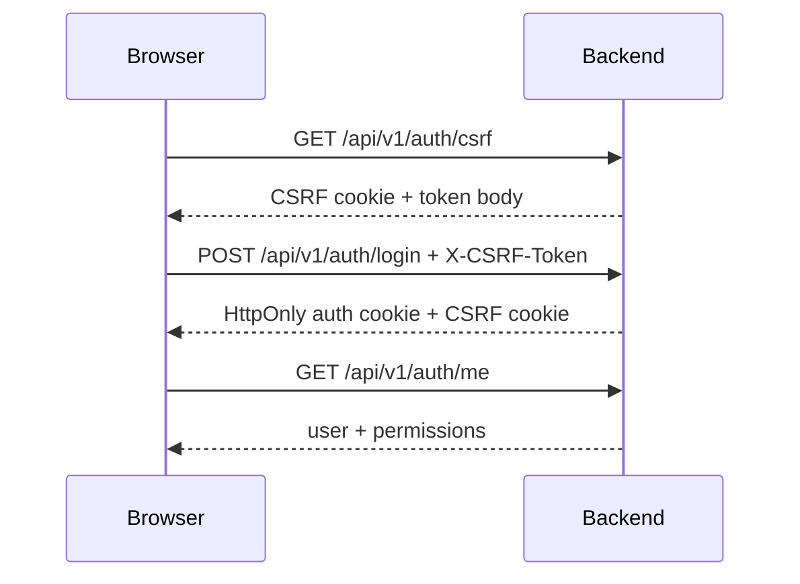
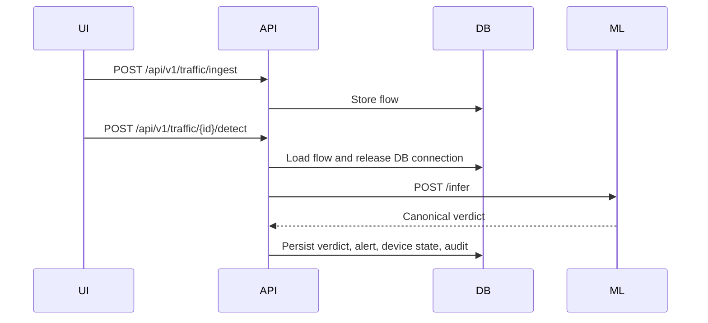

# OT/ICS Detection and Response Platform

Production-oriented OT/ICS security monitoring platform with a React SOC UI, FastAPI backend, PostgreSQL, Redis/Celery, an isolated ML inference service, and an Nginx gateway.

The platform is designed for defensive industrial monitoring: structured OT flow ingestion, ML-assisted detection, alerting, device state tracking, audit logging, permission-based RBAC, and secure cookie-based sessions.

## Architecture



Services:

- `gateway`: public entry point, API proxy, SSE proxy, TLS template support.
- `frontend`: Vite-built React SPA served by Nginx with CSP nonce injection.
- `backend`: FastAPI API, auth, CSRF, RBAC, audit, traffic, alerts, devices, streams.
- `backend-worker`: Celery worker for retraining jobs.
- `ml-service`: internal-only inference and retraining API.
- `postgres`: durable application data.
- `redis`: Celery broker/cache.

The ML service is not exposed through the gateway. Browser traffic should only reach the frontend and `/api`.

## Security Model

- Auth uses HttpOnly cookie sessions. JWTs are not stored in `localStorage`.
- CSRF uses a double-submit cookie and `X-CSRF-Token` header for unsafe methods.
- RBAC is permission-based. Backend dependencies enforce permissions; frontend guards only improve UX.
- Runtime security events and CSP reports are written to audit logs.
- Production config validation rejects weak JWT secrets, insecure cookies, bootstrap admin, hidden admin bypasses, exposed auth tokens, and enabled public OT snapshots.
- Nginx injects a per-request CSP nonce into the SPA entry HTML.

Detailed docs:

- `SECURITY_ARCHITECTURE.md`
- `CSRF_AND_SESSION_SECURITY.md`
- `PERMISSION_RBAC_ARCHITECTURE.md`
- `FRONTEND_RUNTIME_SECURITY.md`
- `RUNTIME_STABILITY_AUDIT.md`

## Quick Start: Windows Dev

```bat
ICS.bat
```

This starts the hot-reload development stack. Type `q` in the same window to stop containers while keeping images and volumes.

Equivalent PowerShell:

```powershell
./scripts/start-dev.ps1
```

The dev script creates missing `.env`, `backend/.env`, and `ml-service/.env` from examples, starts Docker Desktop when possible, runs migrations, and waits for gateway health.

## Production Start

Production requires real secrets and TLS files.

1. Copy and edit environment files:

```powershell
Copy-Item .env.example .env
Copy-Item backend/.env.example backend/.env
Copy-Item ml-service/.env.example ml-service/.env
```

2. Set at minimum:

```env
APP_ENV=production
APP_DEBUG=false
AUTH_COOKIE_SECURE=true
JWT_SECRET_KEY=<64-char-or-strong-random-secret>
ML_SERVICE_API_KEY=<strong-shared-internal-key>
POSTGRES_PASSWORD=<strong-db-password>
GATEWAY_PORT=80
GATEWAY_HTTPS_PORT=443
TLS_CERT_PATH=./gateway/certs/fullchain.pem
TLS_KEY_PATH=./gateway/certs/privkey.pem
```

3. Place TLS certificate and key at the configured paths.

4. Start:

```powershell
./scripts/start-prod.ps1
```

Manual equivalent:

```powershell
docker compose -f docker-compose.yml -f docker-compose.prod.yml up -d --build
```

## Reset Local Dev

```powershell
./scripts/reset-dev.ps1
```

This removes dev containers, volumes, local build output, Python caches, and TypeScript build info.

## Health Checks

- Gateway liveness: `GET /healthz`
- Gateway readiness proxy: `GET /readyz`
- Backend liveness: `GET /healthz`
- Backend readiness: `GET /readyz`
- ML liveness: `GET /healthz`
- Metrics: `GET /metrics` when enabled and authorized

`/readyz` validates database, Redis, and ML service connectivity and returns structured `503` details when dependencies are unavailable.

## Development Commands

Frontend:

```powershell
cd frontend
npm ci
npm run dev
npm run build
npm test -- --run
npm run security:audit
```

Backend:

```powershell
docker compose -f docker-compose.yml -f docker-compose.dev.yml exec -T backend pytest -q
python -m compileall backend/app scripts
```

Integration smoke test:

```powershell
$env:ICS_TEST_PASSWORD="<test-user-password>"
python scripts/integration_test.py
```

The integration test uses cookie auth plus CSRF and does not expect bearer tokens.

## Environment Notes

- Root `.env` drives Compose-level values.
- `backend/.env` drives backend settings when running inside `/app` or local backend contexts.
- `ml-service/.env` drives ML-service-only settings.
- `.env.example` files are templates only. Do not run production from example files.
- `PUBLIC_LIVE_SNAPSHOT_ENABLED` must remain `false` in production.
- `HIDDEN_ADMIN_EMAILS` must remain empty in production.
- `AUTH_COOKIE_SECURE=true` requires HTTPS at the browser boundary.

## Runtime Flows

Auth and CSRF:



Detection:



SSE:

```mermaid
flowchart LR
  Browser[EventSource with cookies] --> Gateway[/api/v1/stream/alerts]
  Gateway --> Backend[bounded stream]
  Backend --> DB[(snapshot reads)]
```

Streams are capped by backend settings and close after a maximum connection duration.

## Operational Checklist

- Run Alembic migrations before accepting production traffic.
- Confirm `/readyz` is healthy after deployment.
- Confirm ML service rejects requests without `X-ML-Internal-Key`.
- Confirm `/api/v1/public/live-snapshot` is disabled unless explicitly needed for a synthetic demo.
- Confirm cookies are `HttpOnly`, `Secure`, and `SameSite=lax`.
- Confirm CSP nonce appears in `index.html` and the built module script tag.
- Confirm SSE works through the gateway without buffering.
- Confirm audit logs record auth, CSRF, permission denials, detection, CSP, and runtime events.

## Troubleshooting

- Local Python dependency failures on Python 3.14: use Docker or Python 3.11. `psycopg2-binary` wheels may not exist for newer Python versions.
- Blank frontend after CSP changes: inspect `index.html` response headers and verify nonce injection.
- Login succeeds but POSTs fail with 403: refresh `/api/v1/auth/csrf`, then retry with `X-CSRF-Token`.
- Gateway is healthy but app is not ready: call `/readyz`, not only `/healthz`.
- ML inference returns 503: check `ML_SERVICE_API_KEY`, `ML_INTERNAL_API_KEY`, and ML service logs.
- Frontend dependency audit: non-breaking fixes should be applied first; major Vite upgrades require build/test validation.

## Repository Hygiene

Do not commit:

- `.env`
- `frontend/dist/`
- `node_modules/`
- `__pycache__/`
- `.pytest_cache/`
- `*.tsbuildinfo`
- packet captures (`captures/`, `*.pcap`, `*.pcapng`)

Use `scripts/reset-dev.ps1` to clean local generated artifacts.
