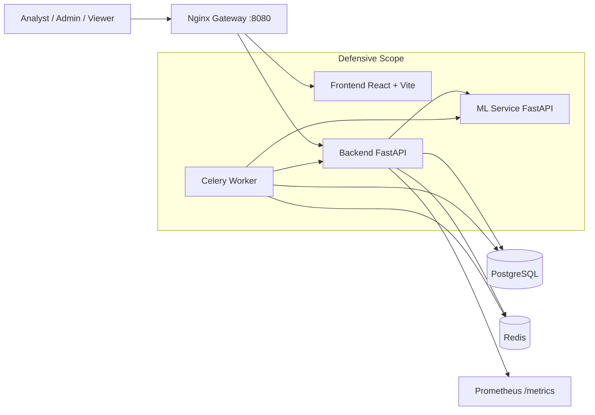

# ICS AI Attack Detection Microservices Platform

Production-oriented, defensive-only microservices platform for ICS traffic monitoring, anomaly detection, and attack classification in near real-time.

## Architecture



## What Is New

- Full dev mode with frontend hot reload (Vite HMR) and backend auto-reload using `docker-compose.dev.yml`.
- `ICS.bat` runs `scripts/start-dev.ps1` automatically (no manual PowerShell command needed).
- `ICS.bat`: type `q` and press Enter to **stop** containers (`compose stop`) — images and volumes stay on disk (no forced rebuild on next start).
- Backend Docker image runs **`alembic upgrade head` on startup** (entrypoint) so Postgres stays migrated; dev script also runs migrations with the correct compose files.
- **Registration:** duplicate **full names** are allowed; only **email** must be unique. JWT `sub` is the **user id** (not display name). Sign-in with **email** if several accounts share the same name.
- **Password reset / verify email:** HTML emails match the dark UI theme; reset token is not pasted as plain text in the HTML body (link/button only). Reset UI asks for **new + confirm password**; `token` comes from the URL query string only.
- **SMTP:** any provider works (not only Gmail); set `SMTP_*` in `backend/.env`. Gmail often needs an **App Password** with 2FA enabled.
- **ML ↔ backend:** traffic sent to `ml-service` `/infer` is converted to the same **NetworkFlow**-style fields as `/predict`, including ICS columns and IPs.
- Security hardening: `slowapi`, secure headers, request metrics; expanded dashboard routes; Celery retrain queue and model versions.

## Core Services

- `gateway`: Nginx reverse proxy (single entrypoint on port `8080`).
- `frontend`: React + TypeScript + Vite UI.
- `backend`: FastAPI API (auth, RBAC, traffic ingest/detection, alerts, model control).
- `backend-worker`: Celery worker for retraining jobs.
- `ml-service`: FastAPI inference/retraining service.
- `postgres`: primary relational storage.
- `redis`: broker/backend for Celery and cache use.

## Security and Domain Coverage

- JWT authentication with RBAC roles: `admin`, `analyst`, `viewer`.
- ICS-aware traffic schema: Modbus, DNP3, and IEC104 fields.
- Detection flow:
  - anomaly signal
  - attack class prediction
  - confidence + risk score + explanation payload
- API protections: CORS, input validation, secure headers, rate limiting.
- Operational endpoints:
  - `/healthz`
  - `/readyz`
  - `/metrics`
- Defensive monitoring only (no offensive tooling).

## Quick Start (Windows)

### Option A: one-click launcher (recommended)

```powershell
./ICS.bat
```

This runs full startup in hot-reload dev mode (build, up, migrate) and validates health.
When you want to stop everything, type `q` in the same `ICS.bat` window.

### Option B: PowerShell full startup (hot-reload dev mode)

```powershell
./scripts/start-platform.ps1
```

### Option C: Development mode (hot reload frontend)

```powershell
./scripts/start-dev.ps1
```

This uses:

```powershell
docker compose -f docker-compose.yml -f docker-compose.dev.yml up -d
```

## Manual Docker Workflow

1. Create env file:

```powershell
Copy-Item .env.example .env
```

2. Start all services:

```powershell
docker compose up --build -d
```

3. Run migrations (usually unnecessary — the **backend** container runs `alembic upgrade head` before `uvicorn`; use this if you need to run migrations manually):

```powershell
docker compose -f docker-compose.yml -f docker-compose.dev.yml exec -w /app backend alembic upgrade head
```

For production-style `docker compose up` **without** the dev override, use:

```powershell
docker compose exec -w /app backend alembic upgrade head
```

4. Seed sample data:

```powershell
docker compose exec -w /app backend python seed_data.py
```

5. Check service status:

```powershell
docker compose ps
```

App URL: `http://localhost:8080`

## Tests

Run all available automated checks:

```powershell
./scripts/run_tests.ps1
```

This executes:

- backend tests (`pytest` inside backend container)
- ml-service tests (`pytest` inside ml-service container)
- integration script (`scripts/integration_test.py`)

## API Overview

Base API prefix: `/api/v1`

### Auth

- `POST /api/v1/auth/login`
- `POST /api/v1/auth/register`
- `GET /api/v1/auth/me`
- `POST /api/v1/auth/forgot-password`
- `POST /api/v1/auth/reset-password`
- `POST /api/v1/auth/request-email-verification`
- `POST /api/v1/auth/verify-email`

### Traffic and Detection

- `POST /api/v1/traffic/ingest`
- `POST /api/v1/traffic/{record_id}/detect`

### Alerts and Dashboard

- `GET /api/v1/alerts`
- `GET /api/v1/alerts/dashboard`

### Model Management

- `POST /api/v1/model/retrain` (admin only)
- `GET /api/v1/model/versions`

### Platform Health

- `GET /healthz`
- `GET /readyz`
- `GET /metrics`

You can also use the ready-made HTTP collection:

- `scripts/api_collection.http`

## Default Seed Login

- Username: `admin`
- Password: `admin123`

## Environment Variables

Root-level defaults are in `.env.example`:

- `POSTGRES_DB`, `POSTGRES_USER`, `POSTGRES_PASSWORD`
- `JWT_SECRET_KEY`, `JWT_ALGORITHM`, `JWT_ACCESS_TOKEN_EXPIRE_MINUTES`
- `GATEWAY_PORT` (default `8080`)

Service-level defaults are in:

- `backend/.env.example`
- `ml-service/.env.example`

### Email Delivery (SMTP)

Password reset and verification emails are sent using standard **SMTP** from `backend/.env`. You can use **any** provider (Microsoft 365, SendGrid, Mailgun, Gmail, your own MTA, etc.) — adjust host, port, TLS/SSL, and credentials accordingly.

Required keys:

- `EMAIL_ENABLED=true`
- `SMTP_HOST`, `SMTP_PORT`, `SMTP_USE_TLS` / `SMTP_USE_SSL` as required by your provider
- `SMTP_USERNAME` and `SMTP_PASSWORD` (for Gmail use an **App Password**, not your normal login password, with 2-Step Verification on)
- `SMTP_FROM_EMAIL` and optional `SMTP_FROM_NAME`
- **`FRONTEND_BASE_URL`** — public URL of the web app (e.g. `http://localhost:8080`). Reset/verify links are built from this; without it, users may see a configuration notice instead of a button link.
- `EMAIL_VERIFICATION_PATH` (default `/verify-email`)
- `PASSWORD_RESET_PATH` (default `/reset-password`)

### Database migrations (duplicate display names)

Revisions **`20260511_01`** and **`20260512_01`** remove the old **unique** rule on `users.username` (the second uses PostgreSQL catalog lookup so non-standard constraint names are dropped). Email stays unique. If registration still fails, restart/rebuild **backend** so `alembic upgrade head` runs, then check `alembic current` includes at least **`20260512_01`**.

### ML service integration

- Backend calls **`POST {ML_SERVICE_URL}/infer`** with the compact traffic JSON; the ML service maps it to internal **NetworkFlow** features before inference.
- Failures return **503** with a readable message when SMTP or ML is unreachable (see backend logs).

## Troubleshooting

- Gateway returns `502`:
  - run `docker compose ps`
  - verify backend/frontend containers are healthy
- **Backend container exits immediately** (gateway/backend dependency fails): almost always **`alembic upgrade head` failing** before `uvicorn` starts. Check logs: `docker logs ics-backend`. Common causes: Postgres not ready, wrong DB URL, or migration SQL error — Alembic now reads **`DATABASE_URL` from the environment** (not only `alembic.ini`).
- Migration fails or **registration** errors mention unique **full name** / **username**:
  - confirm Postgres is healthy
  - run `docker compose -f docker-compose.yml -f docker-compose.dev.yml exec -w /app backend alembic upgrade head` (dev stack)
  - rebuild backend: `docker compose -f docker-compose.yml -f docker-compose.dev.yml build backend` so the image includes the migration entrypoint
  - emergency fix on Postgres: `ALTER TABLE users DROP CONSTRAINT IF EXISTS users_username_key;` (revision **`20260512_01`** tries every matching unique-on-`username` constraint automatically)
- Email not received:
  - check `EMAIL_ENABLED`, `SMTP_*`, and provider rejection logs; Gmail **535** usually means bad App Password or account policy
- Retrain remains queued:
  - verify `backend-worker` and `redis` containers are running
- Frontend cannot call API:
  - verify `http://localhost:8080/healthz` and `http://localhost:8080/api/v1/auth/me`
- **Sign-in** “Several accounts use this name”:
  - use your **email address** in the login field instead of the display name

## Defensive-use Notice

This platform is for ICS monitoring and detection only.
It does not include exploitation, payload generation, or active attack functionality.
