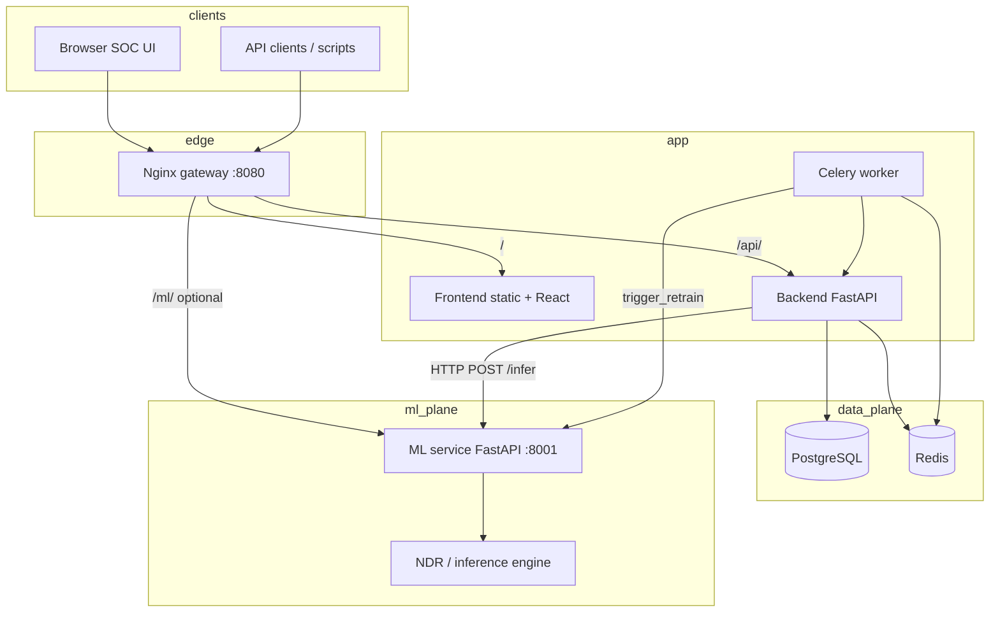
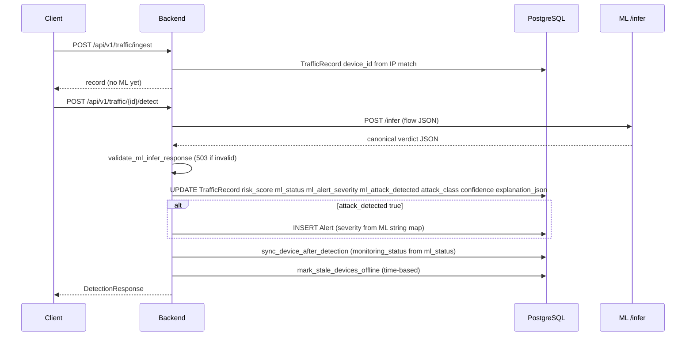

# ICS-Guard OT Cybersecurity Platform

This document is the **system of record** for the repository as implemented today. It describes real data flows, ownership of decisions, API behavior, and known gaps—not a target architecture.

---

## 1. System overview

The platform provides **defensive OT traffic monitoring** with an **ML-driven detection path**:

- **Traffic** is ingested as structured flow records (ICS-oriented fields supported).
- **ML inference** (`ml-service` `/infer`) produces a **canonical verdict JSON** (risk, status, severity, attack flag, class, confidence, explanation).
- The **backend** persists that verdict on the traffic row, optionally **creates an alert** when ML sets `attack_detected: true`, updates **device monitoring state** from ML outcomes, and serves **read APIs + SSE** to the UI.
- The **frontend** is a **SOC-style dashboard**: it loads backend JSON and renders it. It does **not** run the detection model or re-score flows in production logic (see §7).

**Not implemented as an automated product feature today:** closed-loop incident management (no code path creates `Incident` rows when an `Alert` is raised), SOAR/playbooks, automated blocking from dashboard actions, or inline ML on ingest (detection is invoked on demand per record via `/detect`).

---

## 2. Architecture (as deployed)



| Layer | Responsibility (actual code) |
|--------|-------------------------------|
| **ML service** | Runs engine; **`POST /infer`** returns **`canonical_infer_contract(...)`** only: normalizes engine output into the platform JSON contract; on engine/contract failure returns **`unknown_degraded`** (never silent `normal`). **`POST /predict`** and batch **`/predict/batch`** use legacy helpers (`_safe_result` / defaults on item errors)—those paths are **not** used by the backend detection pipeline. |
| **Backend** | Auth, RBAC, onboarding gates, traffic CRUD, **`POST .../detect`** orchestration (call ML → **validate** → persist → alert rule → device sync), alerts listing, dashboard aggregates, device inventory APIs, Celery retrain job that calls ML and writes `ModelVersion`. |
| **Frontend** | JWT session, dashboards, charts from **backend** `ml_status_distribution`, alerts stream, device pages, admin user tooling. **Display-only** security state: explicit mapping from **string labels** returned by the API to colors (not recomputed risk). |
| **Gateway** | `location /api/` → backend; `location /api/v1/stream/` → SSE without buffering; SPA on `/`. |

---

## 3. Data flow (detection path)



**Where ML output is transformed**

- **Inside `ml-service`** (`canonical_infer_contract`): raw engine labels/severity/anomaly flags → **`ml_status`**, **`alert_severity`**, numeric **`risk_score`** / **`confidence`**, **`attack_class`**, and **`attack_detected`** (`true` iff `ml_status` ∈ `{suspicious, under_attack}`). Degraded paths use **`_canonical_degraded_infer_response`** (`ml_status: unknown_degraded`, `attack_detected: true`, `risk_score: null`, etc.).
- **Backend** does **not** change those scalar verdict fields after validation. It **maps** `alert_severity` **string** → SQLAlchemy **`AlertSeverity` enum** for storage only. It **derives** `Alert` row creation from **`attack_detected`** only (`should_generate_alert_from_ml`). It **maps** `ml_status` → device **`monitoring_status`** in `sync_device_after_detection` (including `unknown_degraded` → elevated watch / `suspicious`).

**Where ML “failure” becomes benign**

- **Not on `/infer` for the platform contract:** invalid or incomplete JSON from ML → **HTTP 503** from backend validation; degraded engine conditions → **`unknown_degraded`** from ML service, not `normal`.
- **Elsewhere in ml-service only:** batch `/predict/batch` can attach safe defaults per item on exception—**backend does not call this for `/detect`**.

---

## 4. ML contract (canonical `/infer` body)

The backend **`validate_ml_infer_response`** requires these keys and types (malformed → **503**, record not committed with partial ML):

| Field | Meaning |
|--------|---------|
| `risk_score` | `float` 0–1 or **`null`** (allowed in degraded contract) |
| `ml_status` | One of: `normal`, `suspicious`, `under_attack`, `unknown_degraded` |
| `alert_severity` | One of: `low`, `medium`, `high`, `critical` |
| `attack_detected` | **boolean** — backend creates an **`Alert`** only when this is **`true`** |
| `attack_class` | string (taxonomy label from ML pipeline) |
| `confidence` | number |
| `explanation` | object (audit payload; may include `evaluation_failed`, `failure_reason` in degraded cases) |
| `model_version` | non-empty string |

**Persistence:** traffic row fields `risk_score`, `ml_status`, `ml_alert_severity`, `ml_attack_detected`, `attack_class`, `confidence`, and **`explanation_json`** hold the **returned ML payload** (backend stores `dict(verdict)` for the snapshot). **Verdict scalars are not post-processed** for “softer” outcomes after validation.

---

## 5. Core entities (database truth)

| Entity | Role |
|--------|------|
| **User** | Tenant boundary: `TrafficRecord.user_id`, `Device.user_id`. Roles **`admin`** and **`customer`** are what routes enforce for OT features; **`analyst`** / **`viewer`** exist on the enum for legacy/stream compatibility but are not the primary product RBAC surface. Optional **RBAC** tables exist for admin user management. |
| **Device** | **Inventory** asset (name, IP, metadata, `is_active` operator flag). **`monitoring_status`** and **`last_ml_*`** are updated by **backend** from ML detection + **stale-traffic offline** sweeps—not from arbitrary client metadata (see `sanitize_device_metadata`). |
| **TrafficRecord** | Observation + **persisted ML verdict** after `/detect`. **`device_id`** set at ingest or detect time by **IP ↔ device** resolution. |
| **Alert** | **Derived** row: created only if **`attack_detected`**; severity from ML **`alert_severity`** string mapped to enum. **No public API in this repo** updates alert lifecycle from the SOC UI (status remains schema-supported but not exposed as a full workflow). |
| **Incident** | **Schema + read APIs** (`GET .../users/{id}/incidents`, MTTR aggregation) exist. **No service code path inserts `Incident` when an alert fires** in the current codebase—`incidents_open` / MTTR are often **empty** unless data is loaded by other means. |
| **ModelVersion** | Training metadata rows; updated by **Celery retrain** task consuming ML **`/retrain`** response. |

---

## 6. SOC “response system” (implemented vs partial)

| Capability | Status |
|------------|--------|
| **Detection** | **Implemented:** `/traffic/{id}/detect` → ML → DB. |
| **Alert generation** | **Implemented:** conditional on **`attack_detected`**. |
| **Alert / threat listing** | **Implemented:** `/alerts`, `/alerts/active-threats`, dashboard + SSE snapshot. |
| **Device state** | **Implemented:** ML-driven `monitoring_status` + time-based offline. |
| **SOC Health / telemetry pages** | **Implemented:** `/model/soc-health`, packets-by-hour, inventory edges, etc. |
| **Incident records** | **Partial:** model + list endpoints; **no automatic correlation** from alert → incident in code. |
| **MTTR** | **Implemented** as **read** aggregation over **existing** `Incident` rows; **SLA target** (`target_sla_minutes`) is **hardcoded (20)** in API response—not from tenant config. |
| **Response actions** | **Not implemented** (no automated block/isolate from UI; `ml-service` docstrings may mention “actions” for **`/predict`** demo—**not** wired through backend ingest). |

---

## 7. What is explicitly not part of this system

- **No frontend ML or security scoring:** the UI does not compute `risk_score` or decide attacks; it renders backend fields and **label-based** styling for known `ml_status` strings on charts.
- **No synthetic topology as security truth:** OT Inventory uses **device positions for layout** and **edges only from** `/traffic/inventory-edges` (IP-correlated flow sums)—documented in-app as non-topology.
- **No silent fallback to “normal”** on the **`/infer` → `/detect`** path: failures are **503** or **`unknown_degraded`**.
- **Settings & Privacy** page (as of this repo) is **local UI state only** for toggles—not persisted security policy (reachable from Profile; not SOC telemetry).

---

## 8. Limitations and known gaps

- **Incidents:** no automatic creation; MTTR/dashboard incident counts may not reflect alerts.
- **Seed script (`seed_data.py`):** inserts a **TrafficRecord + Alert** directly **without** going through ML—useful for empty UI demos but **not** representative of the ML contract path.
- **Legacy `GET /model/security-posture`:** still returns fields like **`failed_logins: 0`** (placeholder); **SOC Health** (`/model/soc-health`) is the **aggregate ML/alert/device** view aligned with current SOC UI.
- **ML service `/predict` / batch:** different error-handling semantics than `/infer`; operators should treat **`/infer`** as the **platform contract** for integrated detection.
- **Retrain:** depends on **`backend-worker`**, Redis, and ML **`/retrain`** availability; failures surface as task/HTTP errors.
- **Public snapshot (`/public/live-snapshot`):** marketing-style aggregate; not tenant-scoped.

### Corrections versus earlier README / assumptions

The previous top-level README emphasized generic “anomaly → attack class” language and implied a fuller analyst/viewer RBAC and response stack. **As implemented:** primary roles are **`admin` / `customer`**, detection is **`/infer`-contract-driven**, alerts are **`attack_detected`-gated**, **incidents are not auto-driven**, and **batch predict defaults** are **not** on the live detect path.

---

## 9. Repository and services

| Path / service | Purpose |
|----------------|---------|
| `gateway/` | Nginx entry (`8080` default). |
| `frontend/` | Vite + React; `VITE_API_BASE_URL` defaults to `/api` (browser calls `/api/v1/...`). |
| `backend/` | FastAPI, Alembic, Celery task `retrain_model`. |
| `ml-service/` | Inference + retrain HTTP API used by backend. |
| `docker-compose.yml` (+ `docker-compose.dev.yml`) | Stack definition; backend entrypoint runs migrations. |
| `scripts/` | `start-dev.ps1`, `run_tests.ps1`, integration script, HTTP collections. |

---

## 10. Quick start (Windows)

### One-click (recommended)

```powershell
./ICS.bat
```

Type `q` + Enter in the same window to **stop** containers without removing volumes.

### Or PowerShell

```powershell
./scripts/start-platform.ps1
# or hot reload:
./scripts/start-dev.ps1
```

### Manual Docker

1. Copy env: `Copy-Item .env.example .env` (and `backend/.env.example` → `backend/.env`).
2. `docker compose up --build -d`
3. Migrations: normally **backend container runs `alembic upgrade head`** on start; if needed:  
   `docker compose exec -w /app backend alembic upgrade head`
4. Optional seed: `docker compose exec -w /app backend python seed_data.py`
5. Open `http://localhost:8080`

---

## 11. API surface (detection & SOC)

Base URL through the gateway: **`/api/v1`** (frontend axios base **`/api`** + paths **`/v1/...`**).

**Auth (excerpt)**  
`POST /api/v1/auth/login`, `GET /api/v1/auth/me`, register / password reset / verify email routes as implemented in `backend/app/api/routes/auth.py`.

**Traffic**  
- `POST /api/v1/traffic/ingest` — create observation; IP-based `device_id` link when possible.  
- `POST /api/v1/traffic/{record_id}/detect` — **ML path described in §3**.  
- `GET /api/v1/traffic/packets-by-hour` — volume telemetry.  
- `GET /api/v1/traffic/inventory-edges` — aggregated device↔device flows from stored traffic + IPs.

**Alerts & dashboard**  
- `GET /api/v1/alerts`  
- `GET /api/v1/alerts/dashboard` — includes **`ml_status_distribution`** (coalesced counts).  
- `GET /api/v1/alerts/active-threats`  
- `GET /api/v1/alerts/mttr`  

**Model / SOC health**  
- `GET /api/v1/model/soc-health` — rolling-window ML + alert + device aggregates.  
- `GET /api/v1/model/versions`  
- `POST /api/v1/model/retrain` (admin)  
- `GET /api/v1/model/security-posture` — **legacy** composite endpoint (partial placeholders).

**Stream**  
- `GET /api/v1/stream/alerts?token=...` — SSE snapshots: alerts slice + dashboard summary + **`ml_confidence`** from active **model metadata** (not per-flow verdict).

**Devices**  
CRUD under `/api/v1/devices` / `/devices/me`; metadata sanitized (§5).

Full exploration: `scripts/api_collection.http`.

---

## 12. Tests

```powershell
./scripts/run_tests.ps1
```

Runs backend pytest, ml-service pytest, and the integration script where configured.

---

## 13. Environment variables

- **Root** `.env.example`: Postgres, JWT, gateway port, etc.
- **`backend/.env.example`:** `DATABASE_URL`, `ML_SERVICE_URL`, SMTP, `FRONTEND_BASE_URL`, rate limits, **`device_offline_after_minutes`**, etc.
- **`ml-service/.env.example`:** ML service tuning.

SMTP: any standards-compliant provider; Gmail typically needs an **app password** with 2FA.

---

## 14. Troubleshooting (short)

| Symptom | Likely cause |
|---------|----------------|
| Gateway **502** | Backend/frontend container unhealthy — `docker compose ps`, `docker logs ics-backend`. |
| Backend **exits on start** | **`alembic upgrade head`** failure — DB URL, revision drift, or Postgres not ready. |
| **503** on `/detect` | ML unreachable, invalid JSON, or **contract validation** failed — read backend + ml-service logs. |
| Registration / unique username | Migrations must include username non-unique revisions — see Alembic history `20260511_01` / `20260512_01`; rebuild backend image if revision missing. |
| Retrain stuck | **`backend-worker`** and **Redis** must be running. |

---

## 15. Defensive-use notice

This software is for **monitoring and detection** in authorized OT/ICS environments. It does not provide offensive tooling, exploit generation, or unauthorized traffic manipulation.

---

## Production readiness statement

The **ML → persist → alert → device state** chain is **implemented and contract-guarded** for the **`/infer` + `/detect`** path, suitable for pilots **when** operators accept **manual** `/detect` invocation, **no automated incident object**, **legacy/placeholder** endpoints still present, and **demo seed** data that bypasses ML. Harden for production by **driving `/detect` from your ingest pipeline**, **migrating off placeholder APIs**, and **closing incident/alert workflow gaps** to match your SOC runbooks.
