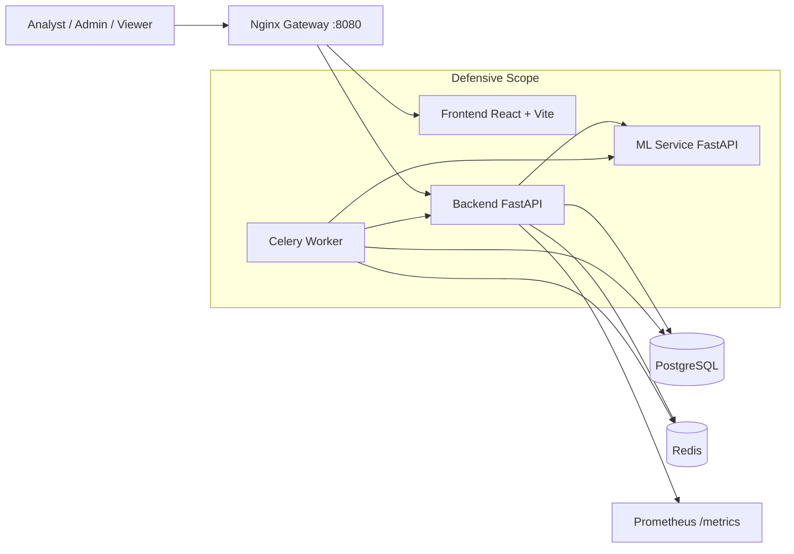

# ICS AI Attack Detection Microservices Platform

Production-oriented, defensive-only microservices platform for ICS traffic monitoring, anomaly detection, and attack classification in near real-time.

## Architecture



## What Is New

- Full dev mode with frontend hot reload (Vite HMR) and backend auto-reload using `docker-compose.dev.yml`.
- `ICS.bat` now runs `scripts/start-dev.ps1` automatically (no manual PowerShell command needed).
- `ICS.bat` now supports graceful shutdown: type `q` and press Enter to run compose down.
- Security hardening in backend middleware:
  - rate limiting with `slowapi`
  - secure response headers
  - request count and latency metrics
- Expanded frontend dashboard routes (alerts, active threats, MTTR, model confidence, security posture, devices, profile/settings).
- Async model retraining queue via Celery (`/api/v1/model/retrain`) with model versions endpoint.
- Auth UX updates:
  - animated auth flow inside login view (login / forgot password / reset / verify)
  - clearer API error messages (e.g. invalid email, duplicate account)
  - forgot-password now returns explicit `Invalid email.` for unknown accounts

## Core Services

- `gateway`: Nginx reverse proxy (single entrypoint on port `8080`).
- `frontend`: React + TypeScript + Vite UI.
- `backend`: FastAPI API (auth, RBAC, traffic ingest/detection, alerts, model control).
- `backend-worker`: Celery worker for retraining jobs.
- `ml-service`: FastAPI inference/retraining service.
- `postgres`: primary relational storage.
- `redis`: broker/backend for Celery and cache use.

## Security and Domain Coverage

- JWT authentication with RBAC roles: `admin`, `analyst`, `viewer`.
- ICS-aware traffic schema: Modbus, DNP3, and IEC104 fields.
- Detection flow:
  - anomaly signal
  - attack class prediction
  - confidence + risk score + explanation payload
- API protections: CORS, input validation, secure headers, rate limiting.
- Operational endpoints:
  - `/healthz`
  - `/readyz`
  - `/metrics`
- Defensive monitoring only (no offensive tooling).

## Quick Start (Windows)

### Option A: one-click launcher (recommended)

```powershell
./ICS.bat
```

This runs full startup in hot-reload dev mode (build, up, migrate) and validates health.
When you want to stop everything, type `q` in the same `ICS.bat` window.

### Option B: PowerShell full startup (hot-reload dev mode)

```powershell
./scripts/start-platform.ps1
```

### Option C: Development mode (hot reload frontend)

```powershell
./scripts/start-dev.ps1
```

This uses:

```powershell
docker compose -f docker-compose.yml -f docker-compose.dev.yml up -d
```

## Manual Docker Workflow

1. Create env file:

```powershell
Copy-Item .env.example .env
```

2. Start all services:

```powershell
docker compose up --build -d
```

3. Run migrations:

```powershell
docker compose exec -w /app backend alembic upgrade head
```

4. Seed sample data:

```powershell
docker compose exec -w /app backend python seed_data.py
```

5. Check service status:

```powershell
docker compose ps
```

App URL: `http://localhost:8080`

## Tests

Run all available automated checks:

```powershell
./scripts/run_tests.ps1
```

This executes:

- backend tests (`pytest` inside backend container)
- ml-service tests (`pytest` inside ml-service container)
- integration script (`scripts/integration_test.py`)

## API Overview

Base API prefix: `/api/v1`

### Auth

- `POST /api/v1/auth/login`
- `POST /api/v1/auth/register`
- `GET /api/v1/auth/me`
- `POST /api/v1/auth/forgot-password`
- `POST /api/v1/auth/reset-password`
- `POST /api/v1/auth/request-email-verification`
- `POST /api/v1/auth/verify-email`

### Traffic and Detection

- `POST /api/v1/traffic/ingest`
- `POST /api/v1/traffic/{record_id}/detect`

### Alerts and Dashboard

- `GET /api/v1/alerts`
- `GET /api/v1/alerts/dashboard`

### Model Management

- `POST /api/v1/model/retrain` (admin only)
- `GET /api/v1/model/versions`

### Platform Health

- `GET /healthz`
- `GET /readyz`
- `GET /metrics`

You can also use the ready-made HTTP collection:

- `scripts/api_collection.http`

## Default Seed Login

- Username: `admin`
- Password: `admin123`

## Environment Variables

Root-level defaults are in `.env.example`:

- `POSTGRES_DB`, `POSTGRES_USER`, `POSTGRES_PASSWORD`
- `JWT_SECRET_KEY`, `JWT_ALGORITHM`, `JWT_ACCESS_TOKEN_EXPIRE_MINUTES`
- `GATEWAY_PORT` (default `8080`)

Service-level defaults are in:

- `backend/.env.example`
- `ml-service/.env.example`

### Email Delivery (SMTP)

Password reset and verification emails are sent by backend service settings in `backend/.env`.

Required keys:

- `EMAIL_ENABLED=true`
- `SMTP_HOST` (e.g. `smtp.gmail.com`)
- `SMTP_PORT` (e.g. `587`)
- `SMTP_USERNAME` and `SMTP_PASSWORD` (use app password for Gmail)
- `SMTP_FROM_EMAIL` and optional `SMTP_FROM_NAME`
- `FRONTEND_BASE_URL` (e.g. `http://localhost:8080`)
- `EMAIL_VERIFICATION_PATH` (default `/verify-email`)
- `PASSWORD_RESET_PATH` (default `/reset-password`)

## Troubleshooting

- Gateway returns `502`:
  - run `docker compose ps`
  - verify backend/frontend containers are healthy
- Migration fails:
  - confirm postgres is healthy
  - rerun `docker compose exec -w /app backend alembic upgrade head`
- Retrain remains queued:
  - verify `backend-worker` and `redis` containers are running
- Frontend cannot call API:
  - verify `http://localhost:8080/healthz` and `http://localhost:8080/api/v1/auth/me`

## Defensive-use Notice

This platform is for ICS monitoring and detection only.
It does not include exploitation, payload generation, or active attack functionality.
