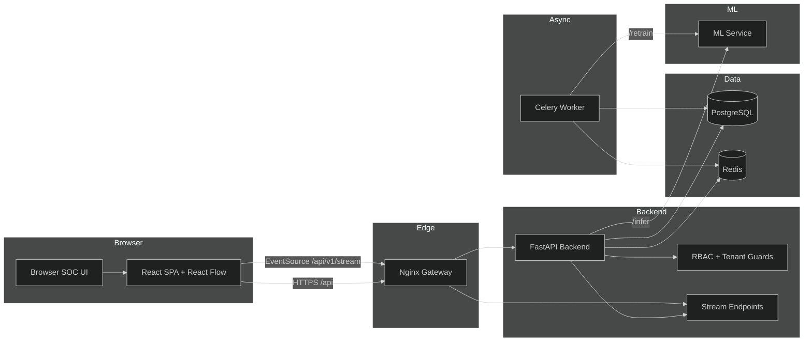
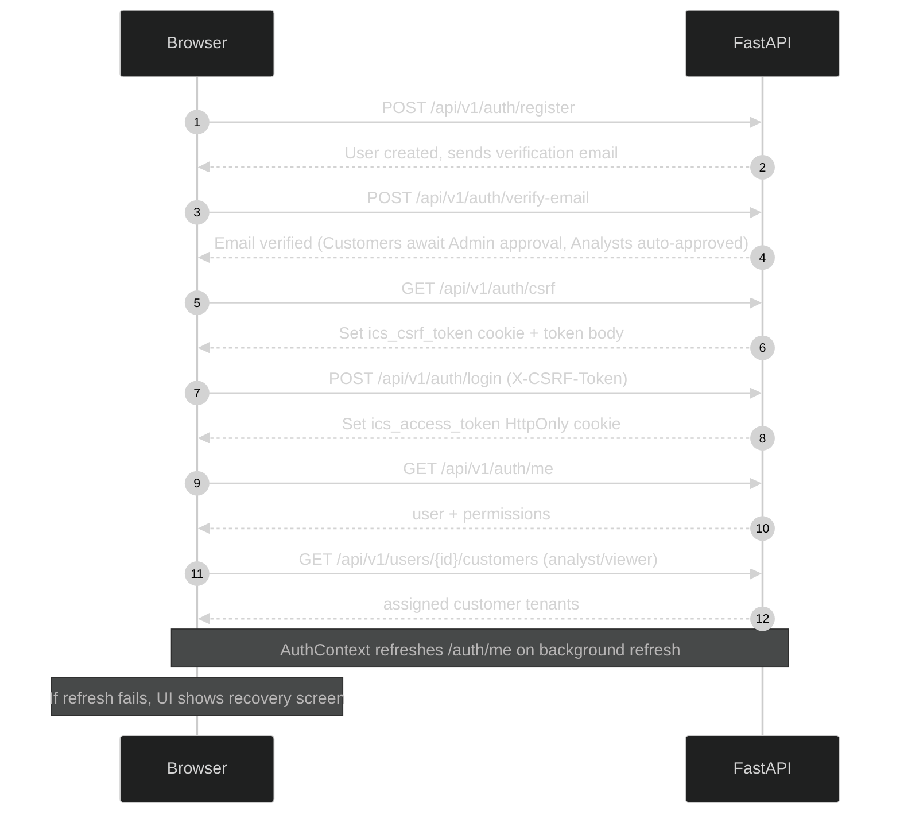
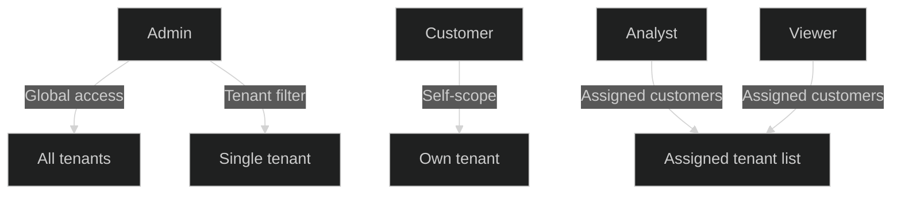
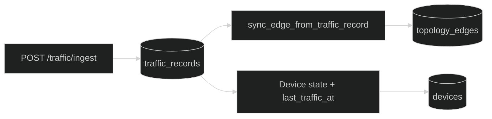
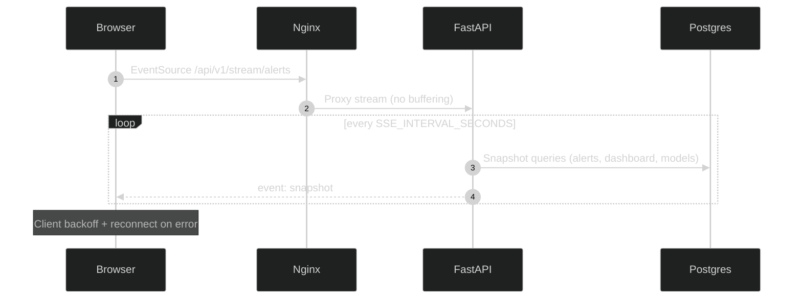
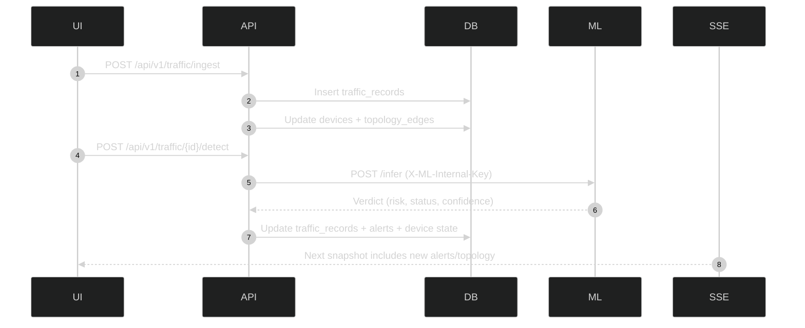

# OT Sentinel AI Platform

OT Sentinel AI is a production-oriented OT/ICS detection and response platform with a React SOC UI, a FastAPI backend, PostgreSQL, Redis + Celery for async work, and an internal ML inference service. It focuses on live telemetry ingestion, topology-aware visibility, and multi-tenant RBAC enforcement.

## Project Overview

The platform ingests OT network flows, runs ML-assisted detection, persists alerts and device state, and streams live SOC updates over SSE. A tenant-aware topology engine tracks relationships between devices and surfaces operational state and traffic activity in the UI.

## Features

- Live OT telemetry ingestion and ML detection workflow
- SOC dashboards (alerts, active threats, SOC health, MTTR)
- Multi-tenant RBAC with permission enforcement on every route
- Tenant-scoped topology graph with React Flow visualization
- SSE streams for alerts and topology snapshots
- Device operational state derived from telemetry + ML status
- Packet capture workflows (Scapy-based) for privileged hosts
- Audit logging for auth, detection, permission denials, and runtime events
- Production-ready gateway with rate limiting and SSE proxying

## Architecture Summary



---

## Request Lifecycle (High-Level)

1. Browser initializes auth bootstrap and tenant scope.
2. Gateway proxies API and SSE requests.
3. Backend enforces RBAC and tenant scoping.
4. Telemetry and topology updates persist to Postgres.
5. SSE streams emit periodic snapshots to the UI.

### Backend Stack

- FastAPI + SQLAlchemy 2.x
- Alembic migrations
- PostgreSQL (primary datastore)
- Redis (Celery broker/result backend)
- Celery (retrain jobs)
- Prometheus client metrics endpoint
- SlowAPI rate limiting

### Frontend Stack

- React 18 + Vite
- React Router
- Tailwind CSS
- React Flow for topology rendering
- EventSource (SSE) for live streams

## Security Model

- Auth uses HttpOnly cookies (JWT) with CSRF double-submit protection.
- Permission checks enforced on the backend via dependency guards.
- Role permissions are resolved from DB roles plus a safe fallback map.
- Admins bypass permission checks but still remain tenant-aware when requested.
- Gateway blocks direct access to ML service routes.

---

## Authentication and Session Bootstrap



## Multi-Tenant RBAC Model

- Users have a primary `users.role` (admin/customer/analyst/viewer).
- Additional role assignments exist via `user_roles` for flexible RBAC.
- Analyst/Viewer users are scoped to customer tenants via assignments.
- Customer users can only access their own tenant data.

See docs:

- docs/RBAC.md
- docs/MULTI_TENANCY.md



## Live Telemetry + Topology

Telemetry ingestion:

- `POST /api/v1/traffic/ingest`
- `POST /api/v1/traffic/{id}/detect`

Topology is built from:

- Observed traffic (`topology_edges` with source=traffic_observed)
- Device metadata relationships
- Manual edge creation

See docs:

- docs/TOPOLOGY.md



## SSE Architecture

Endpoints:

- `GET /api/v1/stream/alerts` (event: `snapshot`)
- `GET /api/v1/stream/topology` (event: `topology_batch`)

Streams are tenant-scoped, authenticated via cookies, and proxied by the gateway with buffering disabled.

See docs:

- docs/SSE_STREAMS.md



## ML Pipeline Overview

- Backend sends normalized telemetry to the ML service `/infer` endpoint.
- ML service responds with risk score, status, confidence, and alert metadata.
- Detection results update `traffic_records`, `alerts`, and device state.
- Retraining runs via Celery (`/api/v1/model/retrain`).

---

## Detection Pipeline



## Folder Structure

```
backend/       FastAPI app, SQLAlchemy models, Alembic
frontend/      React SPA, topology components, SSE client
gateway/       Nginx configs (dev/prod)
ml-service/    Internal ML inference service
scripts/       Dev/prod helpers
```

## Local Development Setup

Windows quick start:

```bat
ICS.bat
```

PowerShell:

```powershell
./scripts/start-dev.ps1
```

The dev script:

- Creates missing .env files
- Starts Docker Desktop (if possible)
- Runs Alembic migrations
- Waits for gateway health checks

## Docker Setup

- Base compose: docker-compose.yml
- Dev overrides: docker-compose.dev.yml
- Prod overrides: docker-compose.prod.yml

Dev:

```powershell
docker compose -f docker-compose.yml -f docker-compose.dev.yml up -d --build
```

Prod:

```powershell
docker compose -f docker-compose.yml -f docker-compose.prod.yml up -d --build
```

## Environment Variables (Core)

Backend:

- `DATABASE_URL`
- `REDIS_URL`
- `ML_SERVICE_URL`
- `ML_SERVICE_API_KEY`
- `JWT_SECRET_KEY`
- `AUTH_COOKIE_SECURE`
- `AUTH_COOKIE_SAMESITE`
- `SSE_MAX_CONNECTIONS`
- `SSE_MAX_CONNECTION_SECONDS`
- `DEVICE_OFFLINE_AFTER_MINUTES`
- `BOOTSTRAP_ADMIN_ENABLED`
- `PUBLIC_LIVE_SNAPSHOT_ENABLED`

Frontend:

- `VITE_API_BASE_URL`

Gateway:

- `GATEWAY_PORT`
- `GATEWAY_HTTPS_PORT`
- `TLS_CERT_PATH`
- `TLS_KEY_PATH`

See backend/.env.example and ml-service/.env.example for complete lists.

## Running Migrations

The backend container runs `alembic upgrade head` on startup unless `SKIP_ALEMBIC=1` is set.

Manual:

```powershell
cd backend
alembic upgrade head
```

## Default Roles

- **Admin**: Full permissions; can access all tenants or target a specific tenant.
- **Customer**: Own-tenant visibility and operational permissions (ingest, detect, devices).
- **Analyst**: Assigned-customer visibility with alert/traffic workflows.
- **Viewer**: Assigned-customer read-only visibility.

## Screenshots (Placeholders)

- `docs/screenshots/dashboard.png`
- `docs/screenshots/topology.png`
- `docs/screenshots/rbac.png`

## API Overview

Auth:

- `/api/v1/auth/register`, `/login`, `/logout`, `/me`, `/csrf`

RBAC:

- `/api/v1/rbac/roles`, `/api/v1/rbac/permissions`, `/api/v1/users/*/roles`

Tenancy:

- `/api/v1/users/{id}/customers`, `/api/v1/users/assignments/bulk`

Telemetry + Detection:

- `/api/v1/traffic/ingest`, `/api/v1/traffic/{id}/detect`

Topology:

- `/api/v1/topology/snapshot`, `/api/v1/topology/edges`

Streams:

- `/api/v1/stream/alerts`, `/api/v1/stream/topology`

Models:

- `/api/v1/model/versions`, `/api/v1/model/retrain`, `/api/v1/model/soc-health`

## Troubleshooting

- SSE disconnects: check gateway buffering settings and SSE limits in backend config.
- Login succeeds but POST fails (403): refresh `/api/v1/auth/csrf` and retry with `X-CSRF-Token`.
- Topology empty: verify device inventory exists and telemetry ingestion is occurring.
- No tenant data for analyst/viewer: confirm customer assignments exist.
- Packet capture failing: Scapy must be installed and host must allow capture privileges.
- Migrations failing on startup: set `SKIP_ALEMBIC=1`, run Alembic manually, then restart.

## Known Limitations

- Topology retention does not include automatic cleanup beyond offline marking.
- SSE streams are polling snapshots (not delta events).
- Packet capture is host-privilege dependent and may be disabled in containers.
- Tenant assignments for analyst/viewer are required before access.

## Future Roadmap

- Zone grouping and MITRE overlays in topology UI
- Attack-path propagation and richer edge analytics
- Dedicated telemetry streaming pipeline (Kafka/MQTT)
- Enhanced protocol parsers for Modbus/DNP3/IEC104

## Docs

- docs/ARCHITECTURE.md
- docs/RBAC.md
- docs/TOPOLOGY.md
- docs/SSE_STREAMS.md
- docs/MULTI_TENANCY.md
