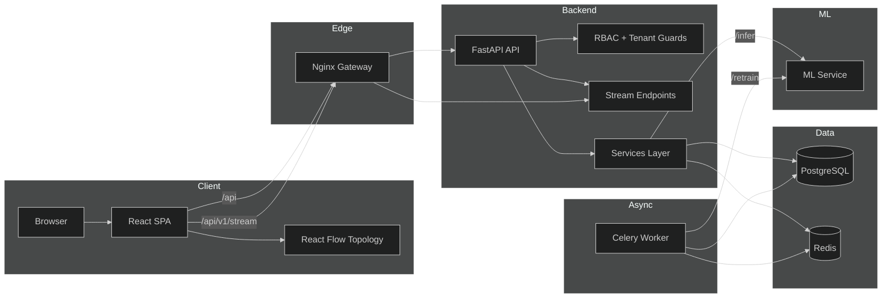
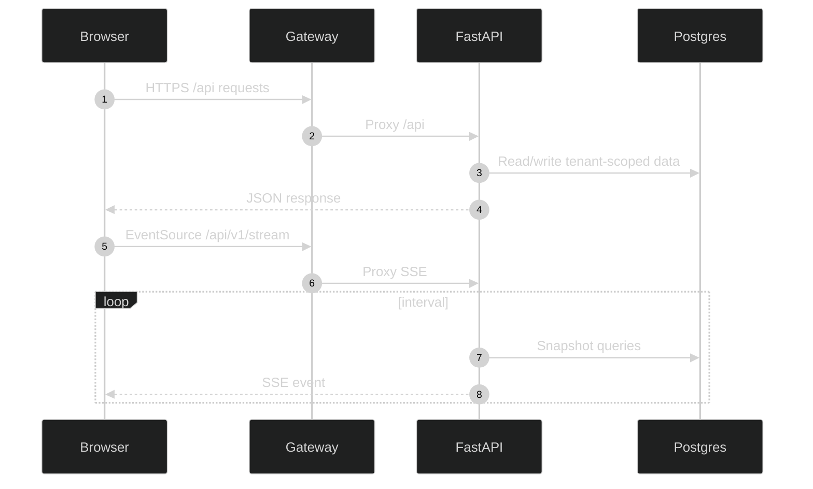
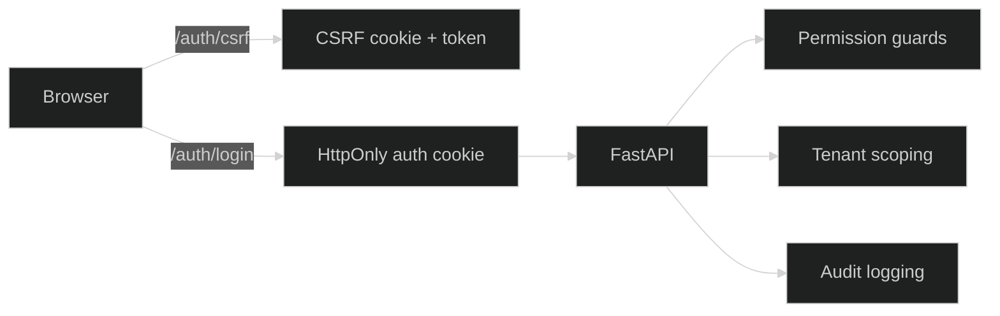
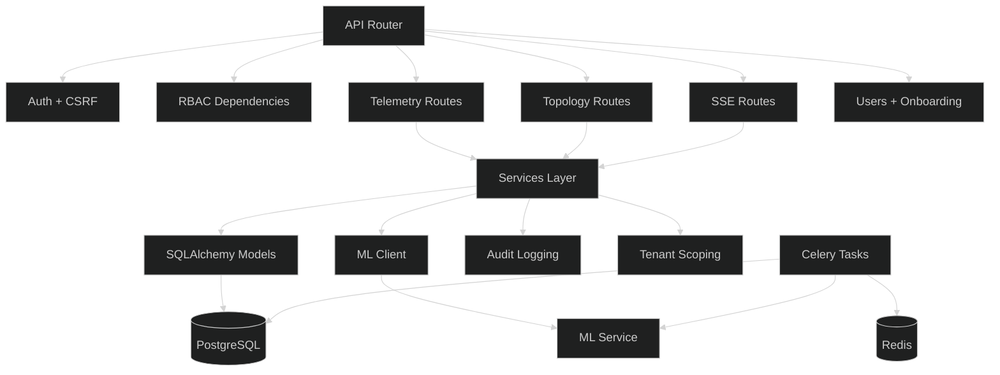
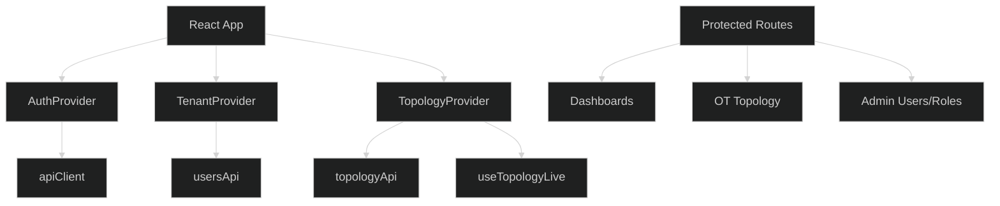

# Architecture

OT Sentinel AI is a multi-service OT/ICS monitoring platform with a React SPA, a FastAPI backend, a PostgreSQL database, Redis + Celery for background work, and an internal ML inference service.

---

## System Architecture



## Service Topology

- Gateway (Nginx): TLS termination, rate limiting, SSE proxying, and routing.
- Frontend (React + Vite): SOC UI, topology view, tenant selector, SSE clients.
- Backend (FastAPI): auth, RBAC, telemetry ingestion, topology, alerts, audit.
- Backend worker (Celery): ML retrain jobs.
- ML service: internal inference and retraining API.
- Postgres: primary data store.
- Redis: Celery broker + results.

## Request Flow

1. Browser authenticates via cookie-based login and CSRF token.
2. API requests pass through gateway to the backend.
3. Backend enforces RBAC and tenant scoping on every route.
4. Telemetry ingestion persists traffic, updates topology, and triggers ML inference.
5. SSE streams deliver periodic snapshots to the UI.

---

## Request Lifecycle (API + SSE)



---

## Security Model



---

## Live Update Flow

```mermaid
%%{init: {'theme': 'dark'}}%%
flowchart LR
	Telemetry[Telemetry ingest + detect] --> DB[(Postgres)]
	DB --> AlertsStream[/stream/alerts]
	DB --> TopologyStream[/stream/topology]
	AlertsStream --> UI[Live SOC cards]
	TopologyStream --> Graph[React Flow graph]
```

---

## Backend Architecture



---

## Frontend Architecture



## Core Modules

- Auth + CSRF: cookie-based JWT + double-submit CSRF tokens.
- RBAC: permissions from DB roles and a static fallback map.
- Multi-tenancy: tenant scoping via analyst/viewer assignments.
- Telemetry: traffic ingestion, protocol distribution, and health metrics.
- Topology: persisted edges, operational state, and live graph snapshots.
- SOC Health: alert and device telemetry aggregates.
- Packet capture: Scapy-based capture workflows.

## Data Stores

- `users`: accounts, onboarding fields, primary role.
- `roles`, `permissions`, `user_roles`: RBAC relationships.
- `user_customer_assignments`: analyst/viewer to customer scoping.
- `traffic_records`: telemetry ingestion and ML verdicts.
- `alerts`, `incidents`: detection outputs and triage.
- `devices`: inventory and operational state.
- `topology_edges`: persisted relationships between devices.
- `model_versions`: ML model metadata and metrics.

## ML Integration

- Backend calls the ML service using `X-ML-Internal-Key`.
- `/infer` responds with risk score, status, and confidence.
- `/retrain` is triggered via Celery and updates `model_versions`.

## SSE Streams

- `GET /api/v1/stream/alerts` emits `snapshot` events.
- `GET /api/v1/stream/topology` emits `topology_batch` events.
- Streams are cookie-authenticated and tenant scoped.

## Migrations

- Alembic is run in `backend/docker-entrypoint.sh` on container start.
- The worker sets `SKIP_ALEMBIC=1` to avoid race conditions.

## Deployment Notes

- ML service is internal-only; gateway blocks `/ml/*` routes.
- Gateway disables buffering for SSE endpoints.
- Production enforces secure cookies and disables bootstrap admin.
