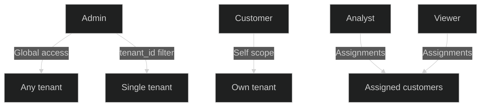
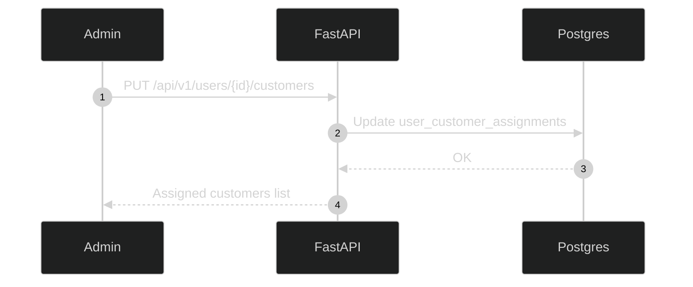
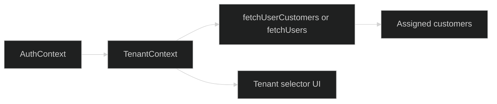

# Multi-Tenancy

Tenancy is based on customer users. Tenant IDs are the `users.id` values for customer accounts.

---

## Tenant Scoping Diagram

## Role Scoping Rules

- Admin: can access all tenants (or a specific tenant if requested).
- Analyst/Viewer: can access only assigned customer tenants.
- Customer: can access only their own tenant.

## Assignments

Analyst/Viewer assignments are stored in `user_customer_assignments`:

- `assigned_user_id` (analyst/viewer)
- `customer_user_id` (customer tenant)

## Backend Tenant Resolution

`get_accessible_tenant_ids()` returns:

- `None` for admins (global access)
- `[tenant_id]` for a requested tenant
- `[-1]` when no assignments exist (safe empty result)

---

## Assignment Flow

## Tenant-Aware Endpoints

Most data endpoints accept `tenant_id` as a query param, including:

- `/api/v1/topology/*`
- `/api/v1/traffic/*`
- `/api/v1/stream/*`
- `/api/v1/model/soc-health`

## Frontend Tenant Selector

- Admins can switch between tenants or Global View.
- Analyst/Viewer users are limited to assigned customers.
- Customer users do not see tenant switching.

