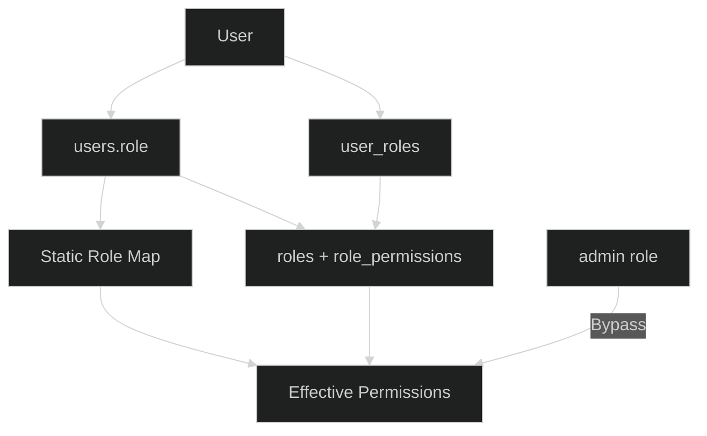
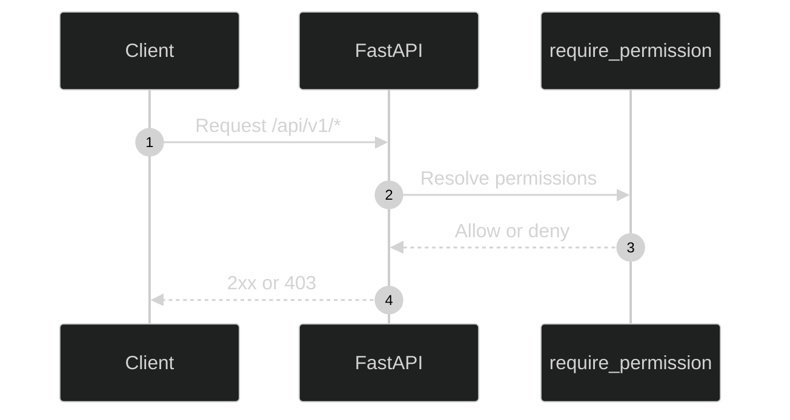
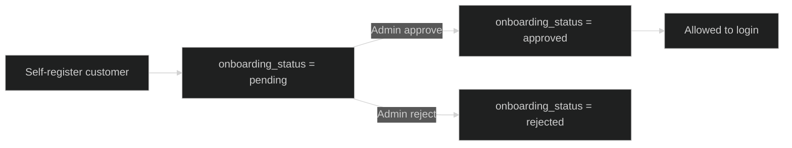

# RBAC

The platform uses a hybrid RBAC model with a primary role on `users.role` and optional many-to-many role assignments via `user_roles`.

---

## RBAC Resolution Flow

## Data Model

- `users.role`: primary role (admin, customer, analyst, viewer).
- `roles`: role definitions (name, description, system flag).
- `permissions`: permission codes.
- `role_permissions`: role-to-permission mapping.
- `user_roles`: optional extra role assignments.

## Permission Resolution

1. Admin role grants all permissions.
2. A static role-to-permission map provides fallback permissions.
3. DB role permissions are added if present (role name matches).
4. Extra roles from `user_roles` are merged.

This ensures the system works even if role permissions have not been seeded yet.

---

## Permission Enforcement

## System Roles

The system expects four base roles:

- admin
- customer
- analyst
- viewer

These are defined in `UserRole` and used by tenant scoping, onboarding gates, and permission mapping.

## Enforcement

- Backend enforces permissions via dependency guards.
- Frontend checks are UX-only.
- Permission checks occur on every protected route.

## Role Assignment Counting

Role counts and role-user listings are resolved from both:

- `user_roles` association table, and
- `users.role` (normalized name matching).

## Approval Flow

- Customer self-registration creates `onboarding_status=pending`.
- Admin approval endpoints move customers to approved and set `is_admin_approved=true`.
- Analyst/Viewer/Admin bypass customer approval gates.

## Assignment Endpoints

- `GET /api/v1/rbac/roles` (with assigned user counts)
- `GET /api/v1/rbac/roles/{id}/users`
- `PUT /api/v1/users/{id}/roles` (role assignment list)
- `PUT /api/v1/users/{id}/customers` (analyst/viewer tenant assignments)

## Protected Roles

System roles cannot be renamed or deleted. Permission changes for system roles are blocked to protect RBAC invariants.
