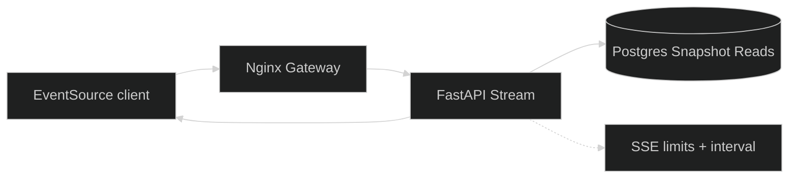
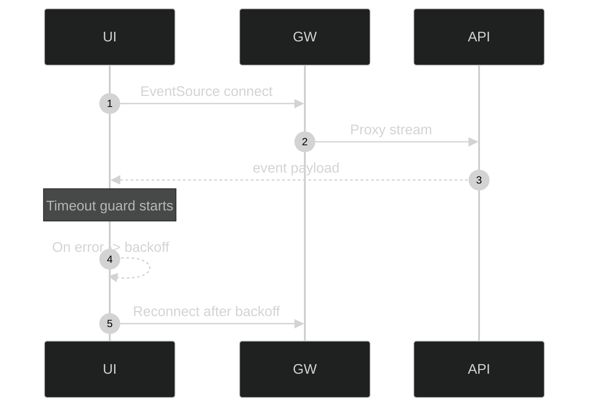

# SSE Streams

The platform uses Server-Sent Events (EventSource) for live updates. Streams are authenticated via cookies and tenant-scoped.

---

## SSE Architecture

## Endpoints

- `GET /api/v1/stream/alerts`
  - Event: `snapshot`
  - Data: alerts list, dashboard summary, ML confidence, timestamp

- `GET /api/v1/stream/topology`
  - Event: `topology_batch`
  - Data: nodes, edges, edge_activity, timestamp, sequence counter

## Auth and Permissions

- Requires a valid auth cookie (`ics_access_token`).
- Enforces `view_streams` permission.
- Applies onboarding access checks.

## Limits

Configurable via environment variables:

- `SSE_MAX_CONNECTIONS`
- `SSE_MAX_CONNECTION_SECONDS`
- `SSE_INTERVAL_SECONDS`

## Gateway Proxy

Gateway disables buffering on `/api/v1/stream/*` and keeps connections open.

## Frontend Reconnect Logic

- EventSource with `withCredentials=true`.
- Connection timeout and exponential backoff.
- Optional visibility-aware pause/resume when tab is hidden.

