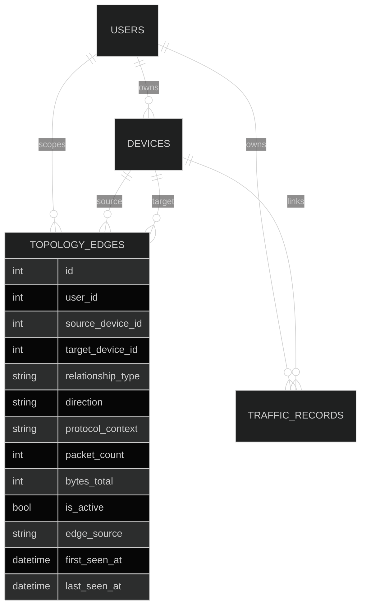
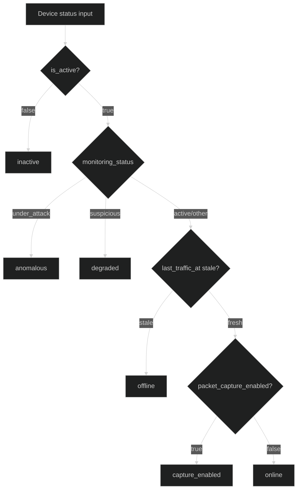
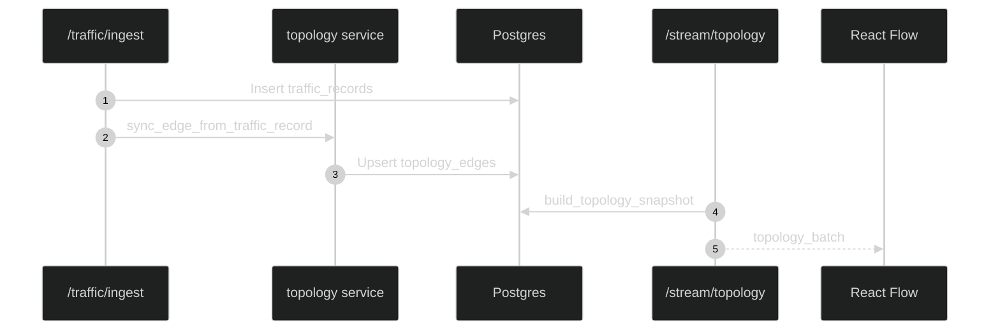
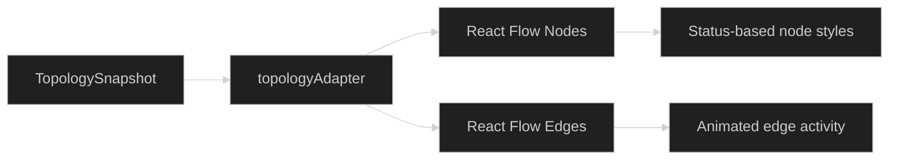

# Topology

Topology is a persisted graph of device relationships derived from telemetry, metadata, and manual edits. It powers both the REST snapshot and the SSE topology stream.

---

## Topology Data Model

## Data Model

`topology_edges` fields include:

- `user_id`, `source_device_id`, `target_device_id`
- `relationship_type` (connected_to, upstream, downstream, peer, parent)
- `direction` (forward, reverse, bidirectional)
- `protocol_context` (modbus, dnp3, iec104, tcp, udp, icmp)
- `packet_count`, `bytes_total`
- `first_seen_at`, `last_seen_at`
- `edge_source` (traffic_observed, metadata_declared, manual)
- `is_active`

Edges are unique per `(user_id, source_device_id, target_device_id, relationship_type)`.

## Edge Sources

- traffic_observed: created from telemetry flows when both endpoints map to devices.
- metadata_declared: created from device metadata fields (connected, parent, peer).
- manual: created via `/topology/edges` API.

## Snapshot Endpoints

- `GET /api/v1/topology/snapshot`
- `GET /api/v1/topology/edges`
- `GET /api/v1/topology/edges/device/{id}`
- `POST /api/v1/topology/edges`
- `POST /api/v1/topology/backfill-traffic`
- `POST /api/v1/topology/sync-metadata`

## Operational State

Device operational state is derived server-side from:

- `last_traffic_at` (staleness threshold)
- `monitoring_status` (under_attack, suspicious, active, offline)
- `metadata_json.packet_capture_enabled`

Priority order:

1. inactive
2. anomalous
3. degraded
4. offline (stale)
5. online
6. unknown

---

## Live Topology Sync

## Live Topology SSE

- `GET /api/v1/stream/topology`
- Event name: `topology_batch`
- Payload includes nodes, edges, edge_activity, and a sequence counter

## Frontend Rendering

- React Flow renders nodes and edges with custom components.
- Nodes are arranged in a grid layout with status-based styling.
- Edges animate when active traffic is present.
- MiniMap colors reflect operational state (online, degraded, anomalous, offline).

